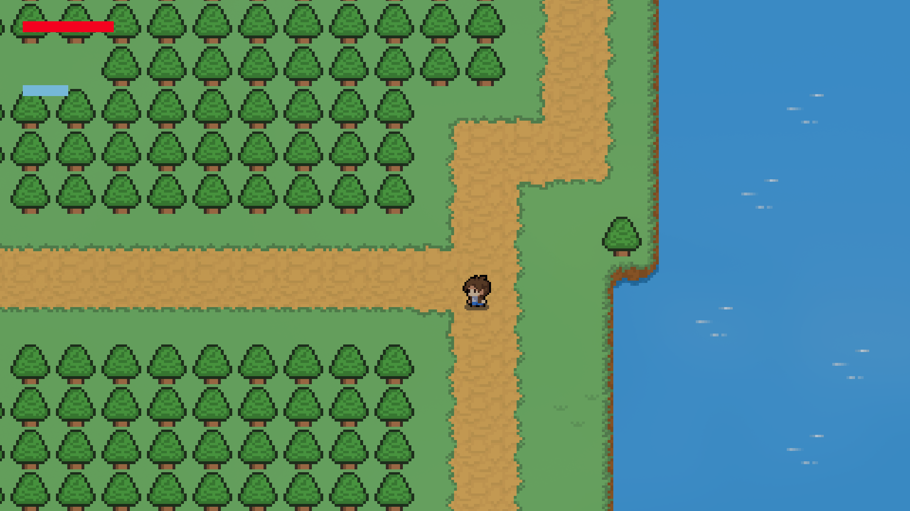
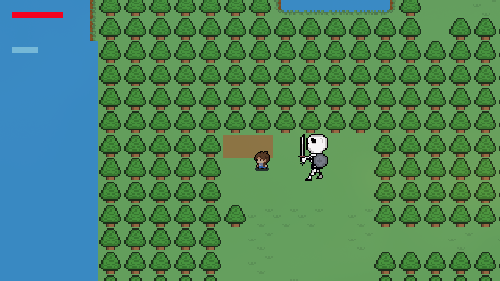
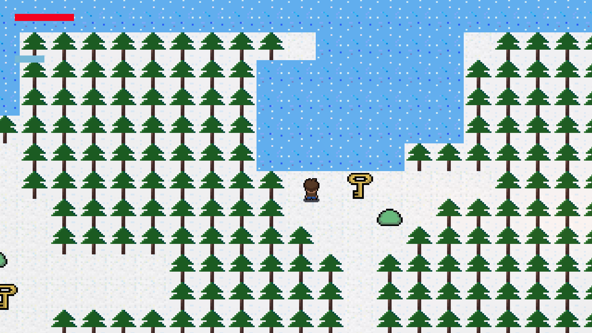

# ChroniclesOf-Ranoa

# HOW TO INSTALL

1. **Clone The repository**:
    ```bash
    git clone https://github.com/ibrahimamam1/ChroniclesOf-Ranoa
    cd ChorniclesOf-Ranoa

2. **Build the project**:
    ```bash
    ./gradlew build

3. **Run the game**:
    ```bash
    java -jar build/libs/ChroniclesOf-Ranoa-main.jar

# Game Screenshots

1. **Level 1**:


2. **Level 2**:


3. **Level 3**:



